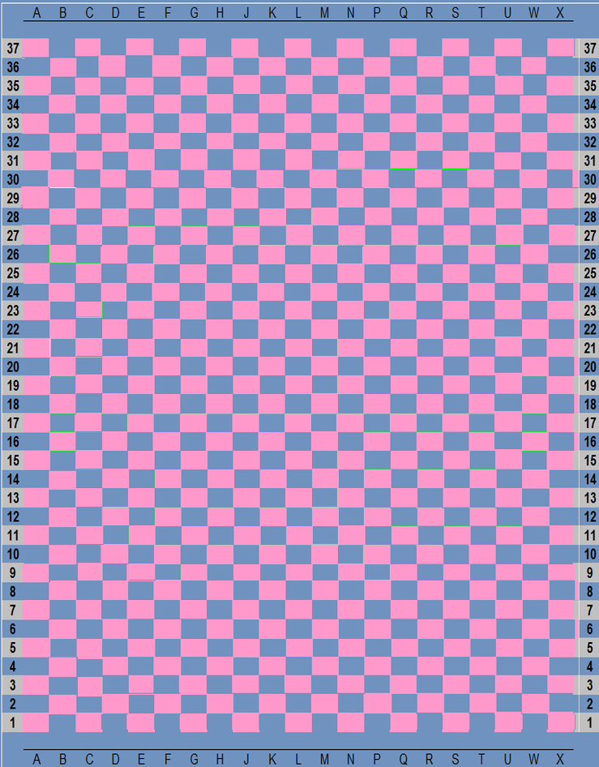
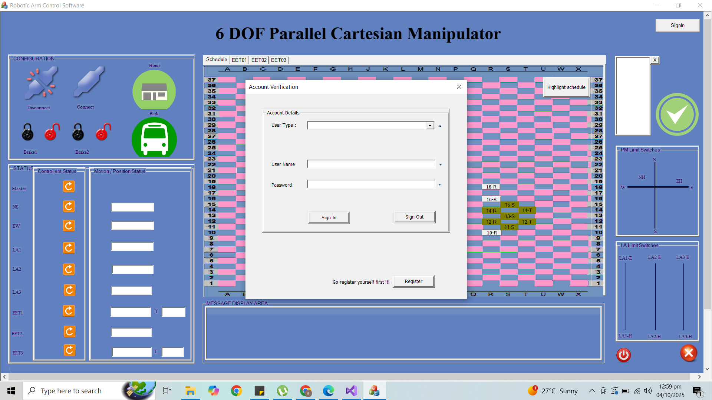
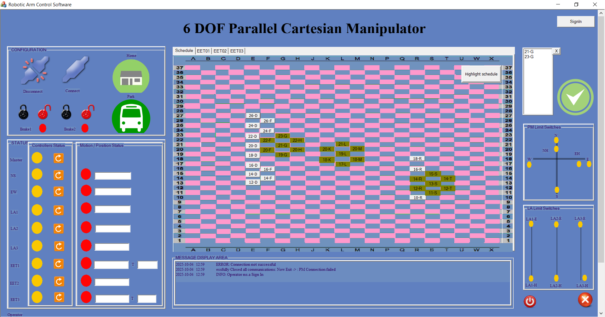
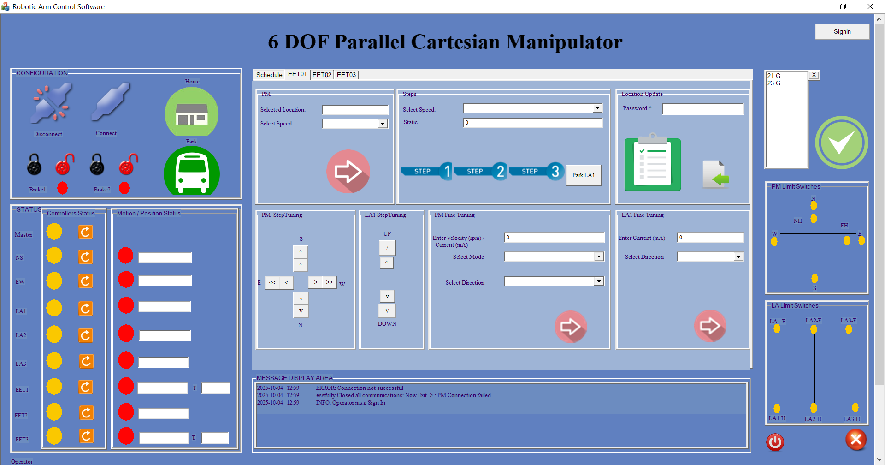
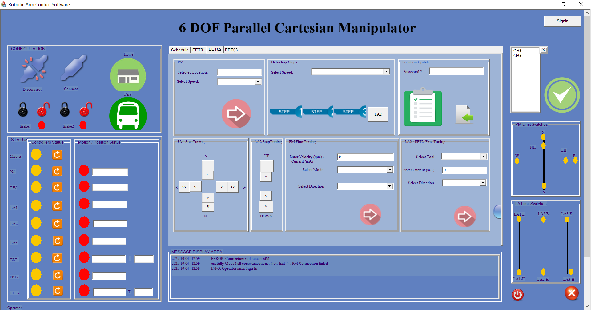
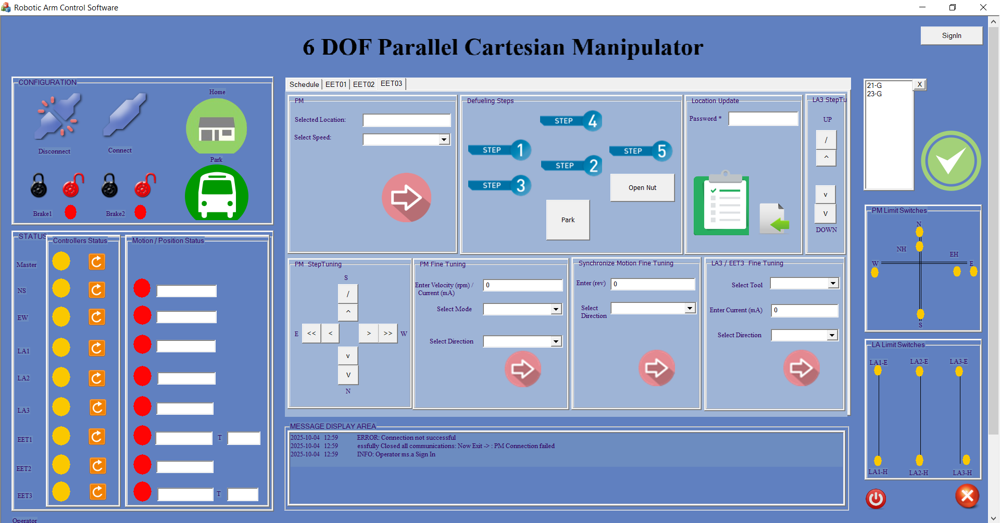

# 6-Degree-of-Freedom-Parallel-Cartesian-Manipulator
This project implements a control system for a 6-DOF Cartesian Parallel Manipulator, developed using Visual Studio’s SDI interface and driven by Maxon EPOS controllers with DC motors. The system is designed for high-precision automation tasks such as nut and bolt handling and operates over a 2D grid from 1A to 37X.



Login Screen


🔧 System Overview
Degrees of Freedom: 6 DOF
Movement: X and Y axes on grid form (1A to 37) Controlled by EPOS-driven DC motors
Z-axis: Three mounted linear actuators, each with a unique end-effector tool (EET)
Limit Switches: Installed on all axes to restrict motion range
(x-y)axis:
Positions: 1A to 37X
Home Position: Grid position 1A
Parking Position: Grid position 4P


1. Linear Actuator 1 connected with End Effector Tool 1(EET1)– Passive Tool Holder
EET1: Holds counterpart of tool using two fingers shaped Passive Tool Holder
Operation: At specific (x-y) location moves in Z-axis to connect the holding tool, with its counterpart. Torque feedback is continoulsy monitored and the motion in z axis is stopeed as the torque reaches certain threshhold.

2. Linear Actuator 2 connected with End Effector Tool 1(EET2) – Super Socket (Active Tool an extra axis(drive) is added to rotate the socket CW and CCW)
EET2: Encapsulates the nut in it and then rotates to tighten the nut
Operation:  At specific (x-y) location moves in Z-axis to encapsulates the nut. Torque feedback of EET2 rotation drive is continoulsy monitored and its CCW rotation is stopeed as the torque reaches certain threshhold.

3. Linear Actuator 3 connected with gripper (EET3)- it grips and rotates
EET3: Securely grips a nut and rotates clockwise (CW) to fasten it with 25 turns.
Operation: At a specified (X, Y) grid location, Linear Actuator 3 moves downward along the Z-axis until the nut is positioned inside the gripper. The gripper then closes to securely hold the nut. Once clamped, the gripper begins rotating counterclockwise (CCW) while simultaneously moving upward. This synchronized motion between the gripper rotation and Linear Actuator 3's Z-axis movement is controlled using the EPOS Master Encoder Mode. Position feedback from Linear Actuator 3 is continuously monitored to precisely stop the operation at the predefined endpoint. To prevent cable entanglement during rotation, a Moflon slip ring module is integrated, ensuring safe and uninterrupted electrical connectivity.

### 📁 Project Organization

```text
Project Organization
/6DOFPCM/
├── /Debug/                    # Visual Studio build output (can be gitignored)
│   └── 6DOFPCM.exe            # Application .exe
│   └── 6DOFPCM.pdb
│   └── EposPCmd.dll
│   └── PM202108.log      │
├── /ipch/                     # IntelliSense precompiled headers (VS-specific)
│
├── /6DOFPCM/                  # Main source folder (same name as project)
│   ├── Debug
│   ├── res                    # Contain all project images
│   ├── 6DOFPCM.vcxproj        # Visual Studio project file
│   ├── 6DOFPCM.vcxproj.filters# Filters for file organization in Solution Explorer
│   ├── 6DOFPCM.vcxproj.user   # User-specific project settings
│   ├── 6DOFPCM.aps            # Binary resource file (auto-generated)
│   ├── 6DOFPCM.cpp            # Main application logic (App class)
│   ├── 6DOFPCM.h              # Main application header
│   ├── 6DOFPCM.rc             # Resource script (UI resources)
│   ├── 6DOFPCM.reg            # Registry script (for file types, etc.)
│   ├── 6DOFPCMDoc.cpp         # Document logic (data management)
│   ├── 6DOFPCMDoc.h           # All variables initialized and assigned here
│   ├── 6DOFPCMView.cpp        # Contains UI display logic, initialization routines, and X-Y axis motion handling
│   ├── 6DOFPCMView.h
│   ├── ClassView.cpp          # Class view integration
│   ├── ClassView.h
│   ├── FileView.cpp           # File view panel logic
│   ├── FileView.h
│   ├── OutputWnd.cpp          # Output/logging window
│   ├── OutputWnd.h
│   ├── PropertiesWnd.cpp      # Properties panel logic
│   ├── PropertiesWnd.h
│   ├── ViewTree.cpp           # Tree view UI logic
│   ├── ViewTree.h
│   ├── MainFrm.cpp            # Main window frame
│   ├── MainFrm.h
│   ├── LoginDlg.cpp           # Login dialog UI
│   ├── LoginDlg.h
│   ├── RegistrationDlg.cpp    # New User registration dialog UI
│   ├── RegistrationDlg.h
│   ├── ScheduleDlg.cpp        # Tab 1 UI
│   ├── ScheduleDlg.h
│   ├── EET02Dlg.cpp           # Dialog for EET 2 (Universal Socket), Tab 3 UI
│   ├── EET02Dlg.h
│   ├── EET03Dlg.cpp           # Dialog for EET 3 (Gripper Tool), Tab 4 UI
│   ├── EET03Dlg.h
│   ├── LA01Dlg.cpp            # Dialog for Linear Actuator 1, Tab 2 UI
│   ├── LA01Dlg.h
│   ├── CGdiPlusBitmap.h       # GDI+ image support
│   ├── GdipButton.cpp         # Custom button control
│   ├── GdipButton.h
│   ├── MemDC.h                # Memory device context (for flicker-free drawing)
│   ├── stdafx.cpp             # Precompiled header source
│   ├── stdafx.h               # Precompiled header
│   ├── targetver.h            # Target Windows version
│   ├── resource.h             # Resource IDs
│   ├── UserImages.bmp         # Bitmap used in the UI
│   ├── ReadMe.txt             # Old readme file
│   ├── LocationLattice.dat    # Grid coordinate data
│   ├── DFO.dat.txt            # Possibly task or configuration data
│   ├── PM202108.log           # Execution logs (August 2021)
│   ├── PM202112.log           # Logs (December 2021)
│   ├── PM202201.log           # Logs (Jan 2022)
│   ├── PM202509.log           # Logs (Sept 2025)
│   ├── PM202510.log           # Logs (Oct 2025)
│
├── /libs/                     # (Suggested) Put your DLLs/libs here
│   ├── EposPCmd.dll           # Maxon EPOS command library (32-bit)
│   ├── EposPCmd64.dll         # Maxon EPOS command library (64-bit)
│   ├── EposPCmd.lib
│   ├── EposPCmd64.lib
│   ├── GdiPlus.lib            # GDI+ support
│   ├── gdiplus.dll
│   ├── vxlapi.dll             # Vector CAN API (driver)
│   └── vxlapi6                # Possibly incomplete, double-check this file
│
├── 6DOFPCM.sln                # Visual Studio solution file
├── 6DOFPCM.sdf                # IntelliSense database (can be ignored)
├── 6DOFPCM.VC.db              # Local DB used by VS (can be ignored)
├── .vs/                       # Visual Studio hidden config folder
│
├── README.md                  # 📘 Project overview and instructions
├── LICENSE                    # 📝 Open-source license (optional)
└── .gitignore                 # 📁 List of files/folders to exclude from Git

To ensure proper execution of the application, you need to define the following environment variables on your Windows system. These variables point to essential configuration and user access files.
1. 
| Variable Name      | Description                             | Example Value             |
| ------------------ | --------------------------------------- | ------------------------- |
| `SDISCHEDULE_PATH` | Path to the operator task schedule file | `D:\Configs\Operator.dat` |
| `SDILOGIN_PATH`    | Path to the authorized user data file   | `D:\Configs\Operator.dat` |

2. Run the 6DOFPCM.exe in Debug folder
3. Select either
   User Type: Operator
   User Name: ms.a
   Password: 123

   or

   User Type: Manager
   User Name: su
   Password: ch


